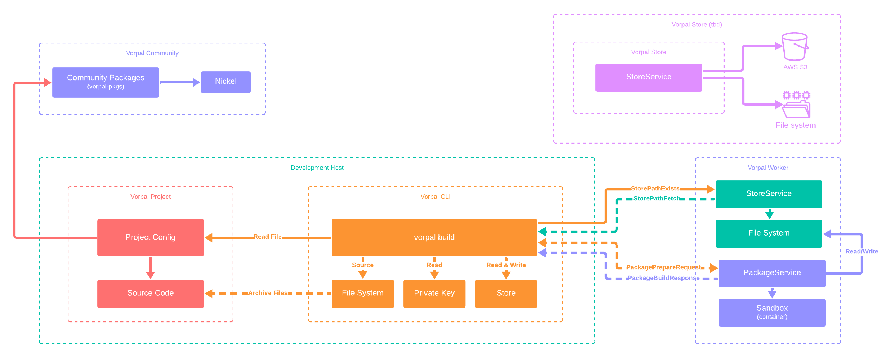

# vorpal

Build and deliver software reliably with one magical tool.

## Overview

Vorpal's goal is to package and distribute software reliably to local (development) and remote (cloud, self-hosted, etc) environments. It uses a `vorpal.ncl` file written in [Nickel](https://nickel-lang.org/) that allows you to "describe" every aspect of your software dependencies in a repeatable and reproducible way.

```nickel
# Built-in validation contracts
let { Config, .. } = import "schema.ncl" in

# Built-in language functions
let { RustPackage, .. } = import "language.ncl" in

# Project configuration (with `--system "<system>"` value)
fun system => {
  packages = {
    default = RustPackage {
      cargo_hash = "<hash>",
      name = "vorpal",
      source = ".",
      systems = ["aarch64-linux", "x86_64-linux"],
      target = system
    }
  }
} | Config
```

## Design

Below is the existing working diagram that illustrates the platform's design:

> [!CAUTION]
> This design is subject to change at ANY moment and is a work in progress.



## Development

### Requirements

The following tool(s) are used to make changes to source code:

- [`direnv`](https://github.com/direnv/direnv)
- [`docker`](https://www.docker.com/products/docker-desktop)

### Steps

- To enter the development environment:

```bash
direnv allow
```

- To run a command in the development environment:

```bash
./dev.sh just <command>
```

- To list all available commands:

```bash
just --list

Available recipes:
    build args=""                     # build everything
    build-docker tag="edge"           # build (docker)
    check args=""                     # check (cargo)
    clean                             # clean everything
    format                            # format cargo
    lint                              # lint
    start                             # start (worker)
    test args                         # test everything
    test-cargo args=""                # test cargo
    test-nickel system="x86_64-linux" # test nickel
    update                            # update (cargo)
```
