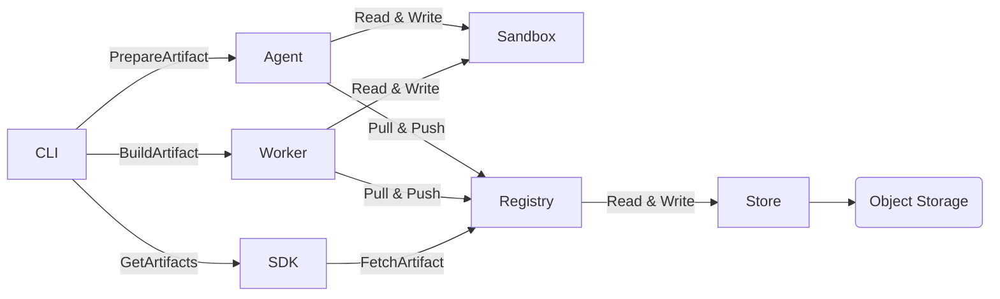

# Vorpal

Build and ship software with one language-agnostic workflow.

## Why?
- Declarative: describe steps once, use them anywhere.
- Cross-language: Rust, Go, and TypeScript SDKs.
- Reproducible: hermetic steps and pinned toolchains.
- Scalable: the same artifacts power your end-to-end flow.

## Architecture
Vorpal is distributed and composed of horizontally scalable components:

- CLI (orchestrator): runs builds and talks to services over gRPC.
- Agent service (localhost): performs filesystem/sandbox tasks close to the workload.
- Registry service (storage): persists artifacts and metadata (e.g., S3-backed in CI).
- Worker service (executor): executes steps in isolated environments; scale by adding workers.

Run services locally during development with `make vorpal-start` (or `cargo run --bin vorpal -- system services start`).



## Setup
### Install (prebuilt binaries):
  - `curl -fsSL https://raw.githubusercontent.com/ALT-F4-LLC/vorpal/refs/heads/main/script/install.sh -o install.sh && sh install.sh`

### Build from source (macOS & Linux):
  - macOS only (once): `xcode-select --install`
  - All platforms: `./script/dev.sh make build` (preferred; installs and uses a consistent toolchain)
  - Common tasks: `make check`, `make test`, `make format`, `make lint`, `make dist`

## Using the SDK
The examples below build a simple artifact for multiple systems and run the context.
Vorpal provides SDKs in **Rust**, **Go**, and **TypeScript** ([`@vorpal/sdk`](https://www.npmjs.com/package/@vorpal/sdk)).

### Rust
```rust
use anyhow::Result;
use vorpal_sdk::{
    api::artifact::ArtifactSystem::{Aarch64Darwin, Aarch64Linux, X8664Darwin, X8664Linux},
    artifact::language::rust::Rust,
    context::get_context,
};

#[tokio::main]
async fn main() -> Result<()> {
    let ctx = &mut get_context().await?;
    let systems = vec![Aarch64Darwin, Aarch64Linux, X8664Darwin, X8664Linux];

    Rust::new("example", systems).build(ctx).await?;

    ctx.run().await
}
```

### Go
```go
package main

import (
    api "github.com/ALT-F4-LLC/vorpal/sdk/go/pkg/api/artifact"
    "github.com/ALT-F4-LLC/vorpal/sdk/go/pkg/artifact/language"
    "github.com/ALT-F4-LLC/vorpal/sdk/go/pkg/config"
)

var systems = []api.ArtifactSystem{
    api.ArtifactSystem_AARCH64_DARWIN,
    api.ArtifactSystem_AARCH64_LINUX,
    api.ArtifactSystem_X8664_DARWIN,
    api.ArtifactSystem_X8664_LINUX,
}

func main() {
    ctx := config.GetContext()

    language.NewGo("example", systems).Build(ctx)

    ctx.Run()
}
```

### TypeScript
```typescript
import {
  ConfigContext,
  ArtifactSystem,
  JobBuilder,
} from "@vorpal/sdk";

const SYSTEMS = [
  ArtifactSystem.AARCH64_DARWIN,
  ArtifactSystem.AARCH64_LINUX,
  ArtifactSystem.X8664_DARWIN,
  ArtifactSystem.X8664_LINUX,
];

async function main() {
  const context = ConfigContext.create();

  await new JobBuilder(
    "example",
    'echo "Hello, World!"',
    SYSTEMS,
  ).build(context);

  await context.run();
}

main().catch((e) => { console.error(e); process.exit(1); });
```

`Vorpal.toml` for TypeScript:
```toml
language = "typescript"
name = "example"

[source]
includes = ["src", "package.json", "tsconfig.json", "bun.lockb"]
```

## Quickstart
These steps assume you installed Vorpal via the installer and have `vorpal` on your PATH.

1) One-time keys

- `vorpal system keys generate`  # installer runs this; safe to re-run

2) Start services (agent, registry, worker)

- If you used the installer, services are already running.
- Otherwise: `vorpal system services start`  # defaults to https://localhost:23151

3) Create a new project (pick Go, Rust, or TypeScript)

- `mkdir hello-vorpal && cd hello-vorpal`
- `vorpal artifact init`  # scaffolds Vorpal.toml and a sample

4) Build your artifact

- `vorpal build "vorpal"`  # builds using the local services
- To get the output path: `vorpal build --path "vorpal"`

5) Run the sample

- `vorpal run example`  # runs the built artifact directly from the store
- Or manually: `ARTIFACT_PATH=$(vorpal build --path "vorpal")` then `$ARTIFACT_PATH/bin/example`

Build this repository

- From the repo root: `vorpal build "vorpal"`
- Optional Go parity (if present): `vorpal build --config "Vorpal.go.toml" "vorpal"`

## Running Artifacts

Use `vorpal run` to execute a built artifact directly from the store without manually locating the output path. The command resolves the artifact locally first, then falls back to pulling from the registry.

```bash
# Basic usage — run an artifact by name
vorpal run rsync -- --help

# Alias format: [<namespace>/]<name>[:<tag>]
vorpal run rsync                           # defaults: namespace=library, tag=latest
vorpal run rsync:3.4.1 -- -avz src/ dest/  # pin a specific version tag
vorpal run team/my-tool:v2.0               # custom namespace and tag

# Override which binary inside the artifact to execute
vorpal run my-tool --bin my-tool-helper -- --verbose

# Point to a remote registry (defaults to localhost)
vorpal run rsync --registry https://registry.example.com:23151
```

**Resolution flow**: local alias → registry alias lookup → pull artifact archive → execute binary.

**Errors and troubleshooting**:
- *"artifact alias not found"* — the artifact hasn't been built yet. Run `vorpal build <name>` first.
- *"binary not found in artifact output"* — the artifact exists but doesn't contain a binary matching the name. The error lists available binaries; use `--bin <name>` to select one.
- *"artifact output not found for digest"* — the alias exists but the output was cleaned up. Rebuild with `vorpal build <name>`.

## Dev & User Environments
Manage development and user-wide environments using the builders:

- Development environment (devenv): creates a portable shell activation (`bin/activate`) that prepends tool artifacts to PATH and sets env vars.
- User environment (userenv): installs activation helpers and safe symlinking under `$HOME/.vorpal/bin`.

**Rust**
```rust
use anyhow::Result;
use vorpal_sdk::{
  api::artifact::ArtifactSystem::{Aarch64Darwin, Aarch64Linux, X8664Darwin, X8664Linux},
  artifact::{ProjectEnvironment, UserEnvironment},
  context::get_context,
};

#[tokio::main]
async fn main() -> Result<()> {
  let ctx = &mut get_context().await?;
  let systems = vec![Aarch64Darwin, Aarch64Linux, X8664Darwin, X8664Linux];

  ProjectEnvironment::new("my-project", systems.clone())
    .with_environments(vec!["FOO=bar".into()])
    .build(ctx).await?;

  UserEnvironment::new("my-home", systems)
    .with_symlinks(vec![("/path/to/local/bin/app", "$HOME/.vorpal/bin/app")])
    .build(ctx).await?;

  ctx.run().await
}
```

**Go**
```go
package main

import (
  api "github.com/ALT-F4-LLC/vorpal/sdk/go/pkg/api/artifact"
  "github.com/ALT-F4-LLC/vorpal/sdk/go/pkg/artifact"
  "github.com/ALT-F4-LLC/vorpal/sdk/go/pkg/config"
)

var systems = []api.ArtifactSystem{
  api.ArtifactSystem_AARCH64_DARWIN,
  api.ArtifactSystem_AARCH64_LINUX,
  api.ArtifactSystem_X8664_DARWIN,
  api.ArtifactSystem_X8664_LINUX,
}

func main() {
  ctx := config.GetContext()

  artifact.NewProjectEnvironment("my-project", systems).
    WithEnvironments([]string{"FOO=bar"}).
    Build(ctx)

  artifact.NewUserEnvironment("my-home", systems).
    WithSymlinks(map[string]string{"/path/to/local/bin/app": "$HOME/.vorpal/bin/app"}).
    Build(ctx)

  ctx.Run()
}
```

**TypeScript**
```typescript
import {
  ConfigContext,
  ArtifactSystem,
  ProjectEnvironmentBuilder,
  UserEnvironmentBuilder,
} from "@vorpal/sdk";

const SYSTEMS = [
  ArtifactSystem.AARCH64_DARWIN,
  ArtifactSystem.AARCH64_LINUX,
  ArtifactSystem.X8664_DARWIN,
  ArtifactSystem.X8664_LINUX,
];

async function main() {
  const context = ConfigContext.create();

  await new ProjectEnvironmentBuilder("my-project", SYSTEMS)
    .withEnvironments(["FOO=bar"])
    .build(context);

  await new UserEnvironmentBuilder("my-home", SYSTEMS)
    .withSymlinks([["/path/to/local/bin/app", "$HOME/.vorpal/bin/app"]])
    .build(context);

  await context.run();
}

main().catch((e) => { console.error(e); process.exit(1); });
```

### Activate
- Development environments: source generated `bin/activate` inside the artifact output when used within a step or your own wrapper script.
- User environments: run `$HOME/.vorpal/bin/vorpal-activate`, then `source $HOME/.vorpal/bin/vorpal-activate-shell`.

## Executors
Vorpal does not lock you to a single executor. Each step sets its executor via `artifact.step[].entrypoint` and `artifact.step[].arguments`.

- Default: Bash. SDK “shell” helpers run in Bash (on Linux these run inside Bubblewrap).
- Custom: Point `entrypoint` to any binary (e.g., `bwrap`, `docker`, `podman`) and pass flags via `arguments`.

**Rust (custom entrypoint/arguments)**
```rust
use anyhow::Result;
use vorpal_sdk::{
    api::artifact::ArtifactSystem::{Aarch64Darwin, Aarch64Linux, X8664Darwin, X8664Linux},
    artifact::{Artifact, ArtifactStep},
    context::get_context,
};

#[tokio::main]
async fn main() -> Result<()> {
    let ctx = &mut get_context().await?;
    let systems = vec![Aarch64Darwin, Aarch64Linux, X8664Darwin, X8664Linux];

    let step = ArtifactStep::new("docker")
        .with_arguments(vec![
            "run", "--rm", "-v", "$VORPAL_OUTPUT:/out",
            "alpine", "sh", "-lc", "echo hi > /out/hi.txt",
        ])
        .build();

    Artifact::new("example-docker", vec![step], systems).build(ctx).await?;

    ctx.run().await
}
```

**Go (custom entrypoint/arguments)**
```go
package main

import (
    api "github.com/ALT-F4-LLC/vorpal/sdk/go/pkg/api/artifact"
    "github.com/ALT-F4-LLC/vorpal/sdk/go/pkg/artifact"
    "github.com/ALT-F4-LLC/vorpal/sdk/go/pkg/config"
)

var systems = []api.ArtifactSystem{
    api.ArtifactSystem_AARCH64_DARWIN,
    api.ArtifactSystem_AARCH64_LINUX,
    api.ArtifactSystem_X8664_DARWIN,
    api.ArtifactSystem_X8664_LINUX,
}

func main() {
    ctx := config.GetContext()

    step, _ := artifact.NewArtifactStep().
        WithEntrypoint("docker", systems).
        WithArguments([]string{"run", "--rm", "-v", "$VORPAL_OUTPUT:/out", "alpine", "sh", "-lc", "echo hi > /out/hi.txt"}, systems).
        Build(ctx)

    artifact.NewArtifact("example-docker", []*api.ArtifactStep{step}, systems).Build(ctx)

    ctx.Run()
}
```

**TypeScript (custom entrypoint/arguments)**
```typescript
import {
  ConfigContext,
  ArtifactSystem,
  ArtifactBuilder,
  ArtifactStepBuilder,
} from "@vorpal/sdk";

const SYSTEMS = [
  ArtifactSystem.AARCH64_DARWIN,
  ArtifactSystem.AARCH64_LINUX,
  ArtifactSystem.X8664_DARWIN,
  ArtifactSystem.X8664_LINUX,
];

async function main() {
  const context = ConfigContext.create();

  const step = new ArtifactStepBuilder("docker")
    .withArguments([
      "run", "--rm", "-v", "$VORPAL_OUTPUT:/out",
      "alpine", "sh", "-lc", "echo hi > /out/hi.txt",
    ])
    .build();

  await new ArtifactBuilder("example-docker", [step], SYSTEMS)
    .build(context);

  await context.run();
}

main().catch((e) => { console.error(e); process.exit(1); });
```

## SDK Reference

Artifact digests are computed identically across all three SDKs (Rust, Go, TypeScript), so artifacts are fully interoperable and cacheable regardless of which SDK produced them.

All SDKs follow the same builder pattern: construct with required fields, chain `with*` methods for options, and call `.build(context)` to register the artifact and get back its SHA-256 digest.

| Builder | Rust | Go | TypeScript | Purpose |
|---------|------|----|------------|---------|
| Job | `Job::new()` | `NewJob()` | `new JobBuilder()` | Run a shell script as a build step |
| Process | `Process::new()` | `NewProcess()` | `new ProcessBuilder()` | Managed background process with start/stop/logs scripts |
| ProjectEnvironment | `ProjectEnvironment::new()` | `NewProjectEnvironment()` | `new ProjectEnvironmentBuilder()` | Dev environment with `bin/activate` |
| UserEnvironment | `UserEnvironment::new()` | `NewUserEnvironment()` | `new UserEnvironmentBuilder()` | User-wide environment with symlink management |
| Language: Rust | `Rust::new()` | `language.NewRust()` | `new RustBuilder()` | Build a Rust/Cargo project with vendored deps |
| Language: Go | `language::Go::new()` | `language.NewGo()` | -- | Build a Go project |
| Language: TypeScript | `TypeScript::new()` | -- | `new TypeScriptBuilder()` | Compile a TypeScript project to a standalone binary using Bun |
| OCI Image | `OciImage::new()` | `NewOciImage()` | `new OciImageBuilder()` | Build an OCI container image tarball (Linux only) |
| Artifact (low-level) | `Artifact::new()` | `NewArtifact()` | `new ArtifactBuilder()` | Custom artifacts with explicit steps and sources |
| ArtifactStep (low-level) | `ArtifactStep::new()` | `NewArtifactStep()` | `new ArtifactStepBuilder()` | Custom steps with arbitrary entrypoints |

### Language Builders

Language builders compile projects and produce standalone binaries as Vorpal artifacts. Each builder fetches the required toolchain from the registry automatically.

**Rust (building a Rust project)**
```rust
use anyhow::Result;
use vorpal_sdk::{
    api::artifact::ArtifactSystem::{Aarch64Darwin, Aarch64Linux, X8664Darwin, X8664Linux},
    artifact::language::rust::Rust,
    context::get_context,
};

#[tokio::main]
async fn main() -> Result<()> {
    let ctx = &mut get_context().await?;
    let systems = vec![Aarch64Darwin, Aarch64Linux, X8664Darwin, X8664Linux];

    Rust::new("my-cli", systems)
        .with_packages(vec!["my-cli-crate".into()])
        .with_bins(vec!["my-cli".into()])
        .with_format(true)
        .with_lint(true)
        .build(ctx).await?;

    ctx.run().await
}
```

**Go (building a Go project)**
```go
package main

import (
    api "github.com/ALT-F4-LLC/vorpal/sdk/go/pkg/api/artifact"
    "github.com/ALT-F4-LLC/vorpal/sdk/go/pkg/artifact/language"
    "github.com/ALT-F4-LLC/vorpal/sdk/go/pkg/config"
)

var systems = []api.ArtifactSystem{
    api.ArtifactSystem_AARCH64_DARWIN,
    api.ArtifactSystem_AARCH64_LINUX,
    api.ArtifactSystem_X8664_DARWIN,
    api.ArtifactSystem_X8664_LINUX,
}

func main() {
    ctx := config.GetContext()

    language.NewGo("my-app", systems).
        WithIncludes([]string{"cmd", "pkg", "go.mod", "go.sum"}).
        Build(ctx)

    ctx.Run()
}
```

**TypeScript (building a TypeScript project)**
```typescript
import { ConfigContext, ArtifactSystem, TypeScriptBuilder } from "@vorpal/sdk";

const SYSTEMS = [
  ArtifactSystem.AARCH64_DARWIN,
  ArtifactSystem.AARCH64_LINUX,
  ArtifactSystem.X8664_DARWIN,
  ArtifactSystem.X8664_LINUX,
];

async function main() {
  const context = ConfigContext.create();

  await new TypeScriptBuilder("my-app", SYSTEMS)
    .withEntrypoint("src/main.ts")                     // default: src/{name}.ts
    .withIncludes(["src", "package.json", "bun.lockb"])
    .build(context);

  await context.run();
}

main().catch((e) => { console.error(e); process.exit(1); });
```

### Process Builder

Creates a managed background process with automatically generated start, stop, and logs helper scripts.

**Rust**
```rust
use anyhow::Result;
use vorpal_sdk::{
    api::artifact::ArtifactSystem::{Aarch64Darwin, Aarch64Linux, X8664Darwin, X8664Linux},
    artifact::{get_env_key, Process},
    context::get_context,
};

#[tokio::main]
async fn main() -> Result<()> {
    let ctx = &mut get_context().await?;
    let systems = vec![Aarch64Darwin, Aarch64Linux, X8664Darwin, X8664Linux];
    let server_digest = "..."; // digest from a previous build step

    Process::new(
        "my-server",
        &format!("{}/bin/server", get_env_key(server_digest)),
        systems,
    )
    .with_arguments(vec!["--port", "3000"])
    .with_artifacts(vec![server_digest.into()])
    .build(ctx).await?;

    ctx.run().await
}
```

**Go**
```go
package main

import (
    api "github.com/ALT-F4-LLC/vorpal/sdk/go/pkg/api/artifact"
    "github.com/ALT-F4-LLC/vorpal/sdk/go/pkg/artifact"
    "github.com/ALT-F4-LLC/vorpal/sdk/go/pkg/config"
)

var systems = []api.ArtifactSystem{
    api.ArtifactSystem_AARCH64_DARWIN,
    api.ArtifactSystem_AARCH64_LINUX,
    api.ArtifactSystem_X8664_DARWIN,
    api.ArtifactSystem_X8664_LINUX,
}

func main() {
    ctx := config.GetContext()
    serverDigest := "..." // digest from a previous build step

    artifact.NewProcess("my-server", artifact.GetEnvKey(serverDigest)+"/bin/server", systems).
        WithArguments([]string{"--port", "3000"}).
        WithArtifacts([]*string{&serverDigest}).
        Build(ctx)

    ctx.Run()
}
```

**TypeScript**
```typescript
import {
  ConfigContext,
  ArtifactSystem,
  ProcessBuilder,
  getEnvKey,
} from "@vorpal/sdk";

const SYSTEMS = [
  ArtifactSystem.AARCH64_DARWIN,
  ArtifactSystem.AARCH64_LINUX,
  ArtifactSystem.X8664_DARWIN,
  ArtifactSystem.X8664_LINUX,
];

async function main() {
  const context = ConfigContext.create();
  const serverDigest = "..."; // digest from a previous build step

  await new ProcessBuilder(
    "my-server",
    `${getEnvKey(serverDigest)}/bin/server`,
    SYSTEMS,
  )
    .withArguments(["--port", "3000"])
    .withArtifacts([serverDigest])
    .build(context);

  await context.run();
}

main().catch((e) => { console.error(e); process.exit(1); });
```

### OCI Image Builder

Builds an OCI container image tarball from a rootfs base and artifact layers. Only supports Linux systems.

**Rust**
```rust
use anyhow::Result;
use vorpal_sdk::{
    artifact::oci_image::OciImage,
    context::get_context,
};

#[tokio::main]
async fn main() -> Result<()> {
    let ctx = &mut get_context().await?;
    let rootfs = "..."; // rootfs artifact digest
    let app_digest = "..."; // digest from a previous build step

    OciImage::new("my-app-image", rootfs)
        .with_aliases(vec!["my-app-image:latest"])
        .with_artifacts(vec![app_digest])
        .build(ctx).await?;

    ctx.run().await
}
```

**Go**
```go
package main

import (
    "github.com/ALT-F4-LLC/vorpal/sdk/go/pkg/artifact"
    "github.com/ALT-F4-LLC/vorpal/sdk/go/pkg/config"
)

func main() {
    ctx := config.GetContext()
    rootfs := "..." // rootfs artifact digest
    appDigest := "..." // digest from a previous build step

    artifact.NewOciImage("my-app-image", rootfs).
        WithAliases([]string{"my-app-image:latest"}).
        WithArtifacts([]*string{&appDigest}).
        Build(ctx)

    ctx.Run()
}
```

**TypeScript**
```typescript
import { ConfigContext, OciImageBuilder } from "@vorpal/sdk";

async function main() {
  const context = ConfigContext.create();
  const rootfs = "..."; // rootfs artifact digest
  const appDigest = "..."; // digest from a previous build step

  await new OciImageBuilder("my-app-image", rootfs)
    .withAliases(["my-app-image:latest"])
    .withArtifacts([appDigest])
    .build(context);

  await context.run();
}

main().catch((e) => { console.error(e); process.exit(1); });
```

### Step Functions

All SDKs provide convenience functions for creating artifact steps:

| Function | Description |
|----------|-------------|
| `shell` | Bash on macOS, Bubblewrap sandbox on Linux (recommended default) |
| `bash` | Plain Bash step with PATH from artifact bins |
| `bwrap` | Bubblewrap sandbox step (Linux) |
| `docker` | Docker container step |

`shell` is the recommended default -- it automatically sandboxes on Linux using Bubblewrap while falling back to plain Bash on macOS.

### How It Works

1. Vorpal compiles your config (Rust binary, Go binary, or TypeScript via [Bun](https://bun.sh/)) into a standalone executable.
2. The executable parses CLI arguments and connects to the Vorpal agent and registry via gRPC.
3. Each `.build(context)` call serializes the artifact to JSON, computes a SHA-256 digest, and sends it to the agent.
4. After all artifacts are defined, `context.run()` starts a gRPC server that the CLI queries to retrieve the artifact graph.
5. The CLI topologically sorts the graph and builds each artifact through the worker service.

For language-specific API details, see the [TypeScript SDK README](sdk/typescript/README.md).

## Contribute
- Read the contributor guide: `AGENTS.md` (structure, commands, style, and PR workflow).
- Before opening a PR: `make format && make lint && make test`.
- Prefer small, focused changes with clear descriptions and linked issues.
- For local development, use `./script/dev.sh` or `direnv allow` to get a consistent environment.
