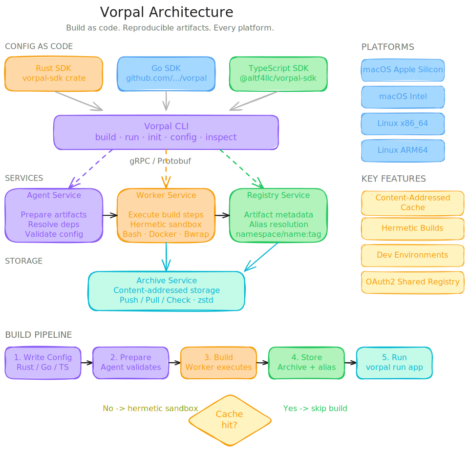

# vorpal

Build and ship software with one powerful tool.


## Overview

Vorpal builds and ships software distributively using BYOL (bring-you-own-language) configurations. This allows developers to manage dependencies to deployments in a reproducible and repeatable way using the language and existing tooling of their choice.

Below are examples of a Rust application in Vorpal configured in different languages:

### Rust

```rust
use anyhow::Result;
use vorpal_schema::vorpal::config::v0::Config;
use vorpal_sdk::config::{artifact::language::rust::rust_artifact, get_context};

#[tokio::main]
async fn main() -> Result<()> {
    let context = &mut get_context().await?;

    let artifact = rust_artifact(context, "example-app").await?;

    context
        .run(Config {
            artifacts: vec![artifact],
        })
        .await
}
```

### Go

```go
package main

import (
    "context"
    "log"

    "github.com/vorpal-sdk/vorpal"
    "github.com/vorpal-sdk/vorpal/config"
    "github.com/vorpal-sdk/vorpal/config/artifact/language/rust"
)

func main() {
    context, err := config.GetContext(context.Background())
    if err != nil {
        log.Fatal(err)
    }

    artifact, err := rust.Artifact(context, "example-app")
    if err != nil {
        log.Fatal(err)
    }

    err = context.Run(config.Config{
        Artifacts: []config.Artifact{artifact},
    })
    if err != nil {
        log.Fatal(err)
    }
}
```

### TypeScript

```typescript
import { getContext } from '@vorpal/sdk';
import { rustArtifact } from '@vorpal/sdk/config/artifact/language/rust';

async function main() {
    const context = await getContext();

    const artifact = await rustArtifact(context, 'example-app');

    await context.run({
        artifacts: [artifact],
    }));
}

main().catch(console.error);
```

## Infrastructure

Below is the existing working diagram that illustrates the platform's design:

> [!CAUTION]
> This design is subject to change at ANY moment and is a work in progress.



## Artifacts

Vorpal uses `artifacts` to describe every aspect of your software in the language of your choice:

```rust
Artifact {
    // name of artifact
    name: "example".to_string(),

    // artifacts for this artifact
    artifacts: vec![],

    // source paths for artifact
    sources: vec![
        ArtifactSource {
            excludes: vec![], // optional, to remove files
            hash: None, // optional, to track changes
            includes: vec![], // optional, to only use files
            name: "example", // required, unique per source
            path: ".", // required, relative location to context
        }
    ],

    // steps of artifact (in order)
    steps: vec![
        ArtifactStep {
            entrypoint: Some("/bin/bash"), // required, host path for command (can be artifact)
            arguments: vec![], // optional, arguements for entrypoint
            environments: vec![], // optional, environment variables for step
            script: Some("echo \"hello, world!\" > $VORPAL_OUTPUT/hello_world.txt"), // optional, script passed to executor
        },
    ],

    // systems for artifact
    systems: vec!["aarch64-linux", "aarch64-macos"],
};
```

Artifacts can be wrapped in language functions and/or modules to be shared within projects or organizations providing centrally managed and reusable configurations with domain-specific overrides (see examples in overview).

### Sources

Coming soon.

### Steps

Steps provided by the SDKs are maintained to provide reproducibile cross-platform environments for them. These environments include strictly maintained low-level dependencies that are used as a wrapper for each step.

> [!NOTE]
> Vorpal enables developers to create their own build steps instead of using the SDKs which are provided to handle "common" scenarios.

#### Linux

On Linux, developers can run steps in a community maintained sandbox which is isolated similiar to containers.

The following are included in the sandbox:

- `bash`
- `binutils`
- `bison`
- `coreutils`
- `curl`
- `diffutils`
- `file`
- `findutils`
- `gawk`
- `gcc`
- `gettext`
- `glibc`
- `grep`
- `gzip`
- `libidn2`
- `libpsl`
- `libunistring`
- `linux-headers`
- `m4`
- `make`
- `ncurses`
- `openssl`
- `patch`
- `perl`
- `python`
- `sed`
- `tar`
- `texinfo`
- `unzip`
- `util-linux`
- `xz`
- `zlib`

#### macOS

Coming soon.

#### Windows

Coming soon.

### Systems

Coming soon.

## Development

### Requirements

#### macOS

On macOS, install the native tools with Xcode:

```bash
xcode-select --install
```

#### Linux

On Linux, install dependencies with the distro's package manger (apt, yum, etc):

> [!IMPORTANT]
> If you are using NixOS, there is a `shell.nix` configuration included for the development environment.

- `bubblewrap` (sandboxing)
- `curl` (downloading)
- `docker` (sandboxing)
- `protoc` (compiling)
- `unzip` (downloading)

The helpful `./script/debian.sh` used for setting up systems in continuous integration can also be used to setup any similiar Debian-based systems.

### Setup

The helpful `./script/dev.sh` used to run development commands in an isolated way without having to update your environment. 

> [!IMPORTANT]
> If you are using NixOS, there is a `shell.nix` configuration included for the development environment.

The following installs missing dependencies then runs `cargo build` inside the development environment:

```bash
$ ./script/dev.sh cargo build
```

#### Direnv

To develop inside the environment the supported solution is to use `direnv` which manages all of this for you. Direnv will automatically run "./script/dev.sh" under the hood and export environment variables to your shell when you enter the directory.

Once you've installed `direnv` on your system navigate to Vorpal's source code and run:

```bash
$ direnv allow
```

### Testing

At this point, you should be able to run `cargo build` successfully in the repository. If that doesn't work, go back to "Setup" and verify you have done all the required steps.

These steps guide how to compile from source and also test compiling Vorpal with Vorpal.

1. Build without Vorpal:

```bash
make build
```

2. Run the initial install script, which will create all relevant directories and permissions needed to run the next steps.

> [!CAUTION]
> This step requires access to protected paths on your host filesystem. As such,
> it will likely require `sudo` privileges (or your system's equivalent) to run.

```bash
bash ./script/install.sh
```

3. Generate keys for Vorpal:

```bash
./target/debug/vorpal keys generate
```

4. Start services for Vorpal:

```bash
./target/debug/vorpal start
```

5. Build with Vorpal:

```bash
./target/debug/vorpal artifact --name "vorpal"
```

The entire stack of has now been tested by building itself.

### Makefile

There is makefile which can be used as a reference for common commands used when developing.

Here are some frequently used:

- `make` (default build)
- `make lint` (before pushing)
- `make dist` (package in `./dist` path)
- `make vorpal-start` (runs services with `cargo`)
- `make vorpal` (builds vorpal-in-vorpal with `cargo`)
