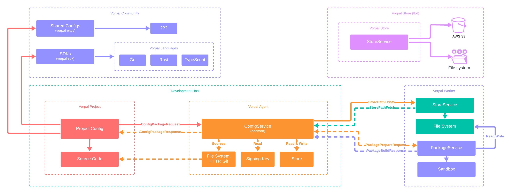

# vorpal

Maintain your entire supply chain with one magical tool.

## Overview

Vorpal is a unified build, development, and deployment system that manages all phases of the software lifecycle and supply chain. Vorpal can compile your code in a reproducible manner and then deliver the resulting "artifacts" for development and deployment environments.

## Design

Below is the existing working diagram that illustrates the platform's design:

> [!CAUTION]
> This design is subject to change at ANY moment and is a work in progress.



## Development

The current development uses these great tools:

- `just`: dev commands
- `nix`: dev builder
- `nix-direnv`: dev environment

### Building

Building the project is managed by `just` and `nix`. Here are steps to building the project locally:

1. Ensure you have `just` and `nix` installed on your system (see more on these tools below)
2. Navigate to Vorpal's project root directory
3. Enter the development environment with `nix develop` or `nix-direnv`

At this point you should be able to use `just` in the shell and can run one of the standardized commands:

- `just build` which uses Cargo for faster builds
- `just package` which uses Nix for reproducible builds

```bash
$ just build # faster builds
$ just package # reproducible builds
```

These commands will compile the source code and create the `vorpal` binary in the project's root directory.

You can then run Vorpal with:

```bash
$ ./vorpal --help
```

> [!NOTE]
> Builds with `nix` may take longer as it doesn't save any build cache like Cargo does. This is why the `just build` command is suggested after entering the `nix` development shell.

### Running

Once you have built Vorpal, you can run it using the generated binary. Here are the steps to run the project:

1. Navigate to the project root directory.
2. Run the `vorpal` binary with the `--help` option to see available commands.

```bash
$ ./vorpal --help
```

This will display a list of available commands and options for running the project.

You can also run specific commands by appending them to the `vorpal` binary. For example, to start the server, you might use:

```bash
$ ./vorpal service build start # start builder
$ ./vorpal service proxy start # start proxy
```

Or, if you'd like to start all services with `nix` run:

```bash
$ just start-all
```

Or, if you'd like to start individual services with `just` and `cargo` run:

```bash
$ just start <service-name>
```

Please refer to the project documentation for a full list of commands and their usage.

### Tools

#### just

Just standardizes all dev and CI recipes (commands) used working with Vorpal source code. To display all available commands run `just` or `just --list`:

```
$ just --list

Available recipes:
    build         # build cli (nix)
    check         # check flake (nix)
    clean         # clean environment
    format        # format code (cargo & nix)
    lint          # lint code (cargo)
    package       # build and install (nix)
    start service # run service (cargo)
    start-all     # run all services (nix)
    test          # test (cargo)
    update        # update flake (nix)
```

#### nix

Until we replace Nix with Vorpal (coming soon), Nix is used to manage all dependencies and create a consistent development environment.

- To build the project using Nix, you can use the command `just build`.
- To enter a development shell with all dependencies available, use `nix-develop` or other tools like `nix-direnv`

#### nix-direnv

`nix-direnv` is a tool that allows you to use `direnv` with `nix` to automatically enter a development shell when you change into a project directory.

> [!TIP]
> This means you don't have to manually run `nix-shell` or `nix-develop` every time you start working on the project.

To use `nix-direnv`:

1. Install `direnv` and `nix-direnv`
2. Run `direnv allow` in Vorpal's project root

Now, every time you change into your project directory, `direnv` will automatically load the development environment specified by `nix`.
