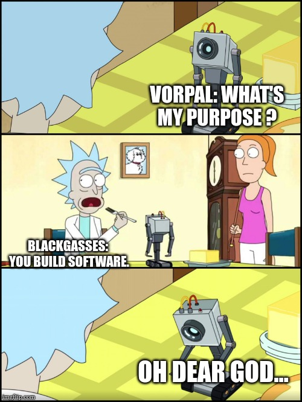
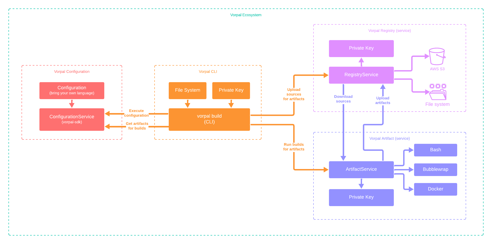

# vorpal

Build and deliver software reliably with one magical tool.



## Overview

Vorpal's goal is to package and distribute software reliably to local (development) and remote (cloud, self-hosted, etc) environments. It uses a `vorpal.ncl` file written in [Nickel](https://nickel-lang.org/) that allows you to "describe" every aspect of your software dependencies in a repeatable and reproducible way.

```nickel
# Built-in validation contracts
let { Config, .. } = import "schema.ncl" in

# Built-in language functions
let { RustPackage, .. } = import "language.ncl" in

# Project configuration (with `--system "<system>"` value)
fun system => {
  packages = {
    default = RustPackage {
      cargo_hash = "<hash>",
      name = "vorpal",
      source = ".",
      systems = ["aarch64-linux", "x86_64-linux"],
      target = system
    }
  }
} | Config
```

## Design

Below is the existing working diagram that illustrates the platform's design:

> [!CAUTION]
> This design is subject to change at ANY moment and is a work in progress.



## Development

### Requirements

The following requirements are necessary to develop source code and dependant on the operating system.

#### macOS

On macOS, install native tools with Xcode:

```bash
xcode-select --install
```

#### Linux

On Linux, install native tools with the distro's package manger (apt, yum, etc):

> [!NOTE]
> Most tools below are used to compile packages for the sandbox environment.

- `autoconf`
- `automake`
- `bison`
- `curl`
- `flex`
- `g++`
- `gcc`
- `libc6-dev`
- `m4`
- `make`
- `perl`
- `tar`
- `texinfo`
- `unzip`

### Steps

These steps guide how to compile from source code and test Vorpal by building it with itself.

> [!IMPORTANT]
> Steps must be run in the root of the cloned repository.

```bash
./script/dev.sh make dist
```

```bash
./dist/vorpal keys generate
```

```bash
./dist/vorpal worker start
```

```bash
./dist/vorpal check
```

```bash
./dist/vorpal build
```
