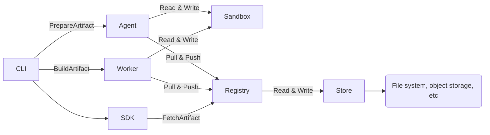

# Vorpal

Build and ship software with one language-agnostic workflow.

## Why?
- Declarative: describe steps once, use them anywhere.
- Cross-language: Rust and Go SDKs today; more to come.
- Reproducible: hermetic steps and pinned toolchains.
- Scalable: the same artifacts power your end-to-end flow.

## Architecture
Vorpal is distributed and composed of horizontally scalable components:

- CLI (orchestrator): runs builds and talks to services over gRPC.
- Agent service (localhost): performs filesystem/sandbox tasks close to the workload.
- Registry service (storage): persists artifacts and metadata (e.g., S3-backed in CI).
- Worker service (executor): executes steps in isolated environments; scale by adding workers.

Run services locally during development with `make vorpal-start` (or `cargo run --bin vorpal -- services start`).



## Setup
### Install (prebuilt binaries):
  - `curl -fsSL https://github.com/ALT-F4-LLC/vorpal/blob/main/script/install.sh -o install.sh && sh install.sh`

### Build from source (macOS & Linux):
  - macOS only (once): `xcode-select --install`
  - All platforms: `./script/dev.sh make build` (preferred; installs and uses a consistent toolchain)
  - Common tasks: `make check`, `make test`, `make format`, `make lint`, `make dist`

## Using the SDK
The examples below build a simple Rust binary artifact for multiple systems and run the context.

### Rust
```rust
use anyhow::Result;
use vorpal_sdk::{
    api::artifact::ArtifactSystem::{Aarch64Darwin, Aarch64Linux, X8664Darwin, X8664Linux},
    artifact::language::rust::RustBuilder,
    context::get_context,
};

#[tokio::main]
async fn main() -> Result<()> {
    let systems = vec![Aarch64Darwin, Aarch64Linux, X8664Darwin, X8664Linux];
    let ctx = &mut get_context().await?;

    RustBuilder::new("example", systems).build(ctx).await?;

    ctx.run().await
}
```

### Go
```go
package main

import (
    api "github.com/ALT-F4-LLC/vorpal/sdk/go/pkg/api/artifact"
    "github.com/ALT-F4-LLC/vorpal/sdk/go/pkg/artifact/language"
    "github.com/ALT-F4-LLC/vorpal/sdk/go/pkg/config"
)

var systems = []api.ArtifactSystem{
    api.ArtifactSystem_AARCH64_DARWIN,
    api.ArtifactSystem_AARCH64_LINUX,
    api.ArtifactSystem_X8664_DARWIN,
    api.ArtifactSystem_X8664_LINUX,
}

func main() {
    ctx := config.GetContext()

    language.NewRustBuilder("example", systems).Build(ctx)

    ctx.Run()
}
```

## Executors
Vorpal does not lock you to a single executor. Each step sets its executor via `artifact.step[].entrypoint` and `artifact.step[].arguments`.

- Default: Bash. SDK “shell” helpers run in Bash (on Linux these run inside Bubblewrap).
- Custom: Point `entrypoint` to any binary (e.g., `bwrap`, `docker`, `podman`) and pass flags via `arguments`.

Examples

Rust (custom entrypoint/arguments)
```rust
use anyhow::Result;
use vorpal_sdk::{
    api::artifact::ArtifactSystem::{Aarch64Darwin, Aarch64Linux, X8664Darwin, X8664Linux},
    artifact::{ArtifactBuilder, ArtifactStepBuilder},
    context::get_context,
};

#[tokio::main]
async fn main() -> Result<()> {
    let systems = vec![Aarch64Darwin, Aarch64Linux, X8664Darwin, X8664Linux];
    let ctx = &mut get_context().await?;

    let step = ArtifactStepBuilder::new("docker")
        .with_arguments(vec![
            "run", "--rm", "-v", "$VORPAL_OUTPUT:/out",
            "alpine", "sh", "-lc", "echo hi > /out/hi.txt",
        ])
        .build();

    ArtifactBuilder::new("example-docker", vec![step], systems).build(ctx).await?;
    ctx.run().await
}
```

Go (custom entrypoint/arguments)
```go
package main

import (
    api "github.com/ALT-F4-LLC/vorpal/sdk/go/pkg/api/artifact"
    "github.com/ALT-F4-LLC/vorpal/sdk/go/pkg/artifact"
    "github.com/ALT-F4-LLC/vorpal/sdk/go/pkg/config"
)

var systems = []api.ArtifactSystem{
    api.ArtifactSystem_AARCH64_DARWIN,
    api.ArtifactSystem_AARCH64_LINUX,
    api.ArtifactSystem_X8664_DARWIN,
    api.ArtifactSystem_X8664_LINUX,
}

func main() {
    ctx := config.GetContext()

    step, _ := artifact.NewArtifactStepBuilder().
        WithEntrypoint("docker", systems).
        WithArguments([]string{"run", "--rm", "-v", "$VORPAL_OUTPUT:/out", "alpine", "sh", "-lc", "echo hi > /out/hi.txt"}, systems).
        Build(ctx)

    artifact.NewArtifactBuilder("example-docker", []*api.ArtifactStep{step}, systems).Build(ctx)
    ctx.Run()
}
```

## Dev & User Environments
Manage local shells and user-wide commands using the builders.

- Devenv: creates a portable shell activation (`bin/activate`) that prepends tool artifacts to PATH and sets env vars.
- Userenv: installs activation helpers and safe symlinks under `$HOME/.vorpal/bin`.

Rust
```rust
use anyhow::Result;
use vorpal_sdk::{
  api::artifact::ArtifactSystem::{Aarch64Darwin, Aarch64Linux, X8664Darwin, X8664Linux},
  artifact::{devenv::DevenvBuilder, userenv::UserenvBuilder},
  context::get_context,
};

#[tokio::main]
async fn main() -> Result<()> {
  let systems = vec![Aarch64Darwin, Aarch64Linux, X8664Darwin, X8664Linux];
  let ctx = &mut get_context().await?;

  DevenvBuilder::new("my-devenv", systems.clone())
    .with_environments(vec!["FOO=bar".into()])
    .build(ctx).await?;

  UserenvBuilder::new("my-userenv", systems)
    .with_symlinks(vec![("/path/to/local/bin/app", "$HOME/.vorpal/bin/app")])
    .build(ctx).await?;

  ctx.run().await
}
```

Go
```go
package main

import (
  api "github.com/ALT-F4-LLC/vorpal/sdk/go/pkg/api/artifact"
  "github.com/ALT-F4-LLC/vorpal/sdk/go/pkg/artifact"
  "github.com/ALT-F4-LLC/vorpal/sdk/go/pkg/config"
)

var systems = []api.ArtifactSystem{
  api.ArtifactSystem_AARCH64_DARWIN,
  api.ArtifactSystem_AARCH64_LINUX,
  api.ArtifactSystem_X8664_DARWIN,
  api.ArtifactSystem_X8664_LINUX,
}

func main() {
  ctx := config.GetContext()

  artifact.NewDevenvBuilder("my-devenv", systems).
    WithEnvironments([]string{"FOO=bar"}).
    Build(ctx)

  artifact.NewUserenvBuilder("my-userenv", systems).
    WithSymlinks(map[string]string{"/path/to/local/bin/app": "$HOME/.vorpal/bin/app"}).
    Build(ctx)

  ctx.Run()
}
```

### Activate
- Userenv: run `$HOME/.vorpal/bin/vorpal-activate`, then `source $HOME/.vorpal/bin/vorpal-activate-shell`.
- Devenv: source the generated `bin/activate` inside the artifact output when used within a step or your own wrapper script.

## Contribute
- Read the contributor guide: `AGENTS.md` (structure, commands, style, and PR workflow).
- Before opening a PR: `make format && make lint && make test`.
- Prefer small, focused changes with clear descriptions and linked issues.
- For local development, use `./script/dev.sh` or `direnv allow` to get a consistent environment.
