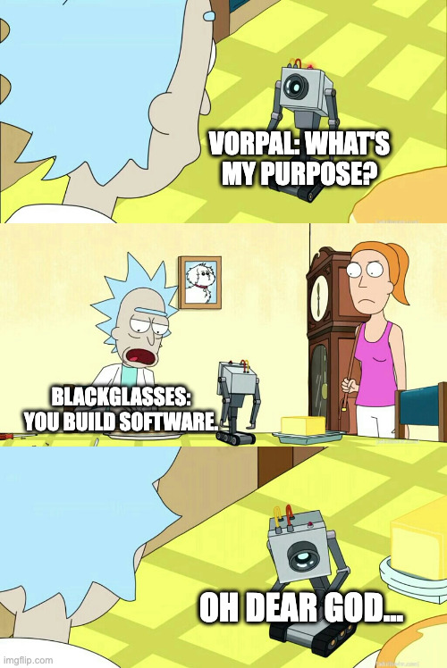

# vorpal

Build and ship software reliably with one powerful tool.



## Overview

Vorpal distributively builds and ships software reliably using BYOL (bring-you-own-language) programmable configurations. This allows developers to manage software dependencies and deployments in a repeatable and reproducible way.

Below are examples of building a Rust application with different configuration languages:

### Rust

```rust
use anyhow::Result;
use vorpal_schema::vorpal::config::v0::Config;
use vorpal_sdk::config::{artifact::language::rust::rust_artifact, get_context};

#[tokio::main]
async fn main() -> Result<()> {
    let context = &mut get_context().await?;

    let artifact = rust_artifact(context, "vorpal").await?;

    context
        .run(Config {
            artifacts: vec![artifact],
        })
        .await
}
```

### Go

```go
package main

import (
    "context"
    "log"

    "github.com/vorpal-sdk/vorpal"
    "github.com/vorpal-sdk/vorpal/config"
    "github.com/vorpal-sdk/vorpal/config/artifact/language/rust"
)

func main() {
    context, err := config.GetContext(context.Background())
    if err != nil {
        log.Fatal(err)
    }

    artifact, err := rust.Artifact(context, "vorpal")
    if err != nil {
        log.Fatal(err)
    }

    err = context.Run(config.Config{
        Artifacts: []config.Artifact{artifact},
    })
    if err != nil {
        log.Fatal(err)
    }
}
```

### TypeScript

```typescript
import { getContext } from '@vorpal/sdk';
import { rustArtifact } from '@vorpal/sdk/config/artifact/language/rust';

async function main() {
    const context = await getContext();

    const artifact = await rustArtifact(context, 'vorpal');

    await context.run({
        artifacts: [artifact],
    }));
}

main().catch(console.error);
```

## Design

Below is the existing working diagram that illustrates the platform's design:

> [!CAUTION]
> This design is subject to change at ANY moment and is a work in progress.


## Development

### Requirements

The following requirements are necessary to develop source code and dependant on the operating system.

#### macOS

On macOS, install native tools with Xcode:

```bash
xcode-select --install
```

#### Linux

On Linux, install native tools with the distro's package manger (apt, yum, etc):

> [!NOTE]
> Most tools below are used to compile packages for the sandbox environment.

- `bubblewrap`
- `curl`
- `docker`
- `protoc`
- `rustup`
- `unzip`

### Direnv

You can use `direnv` to load environment variables, `rustup` and `protoc`.

### Steps

These steps guide how to compile from source code and test Vorpal by building it with itself.

> [!IMPORTANT]
> Steps must be run in the root of the cloned repository.

1. Compile binaries:

```bash
./script/dev.sh make dist
```

2. Generate keys:

```bash
./dist/vorpal keys generate
```

3. Start services:

```bash
./dist/vorpal start
```

4. Check configuration:

```bash
./dist/vorpal config --artifact "<name>"
```

5. Build artifacts:
```bash
./dist/vorpal build --artifact "<name>"
```

## Artifacts

Vorpal uses `artifacts` to describe every aspect of your software in the language of your choice:

```rust
Artifact {
    // name of artifact
    name: "example".to_string(),

    // artifacts for this artifact
    artifacts: vec![],

    // source paths for artifact
    sources: vec![
        ArtifactSource {
            excludes: vec![], // optional, to remove files
            hash: None, // optional, to track changes
            includes: vec![], // optional, to only use files
            name: "example", // required, unique per source
            path: ".", // required, relative location to context
        }
    ],

    // steps of artifact (in order)
    steps: vec![
        ArtifactStep {
            entrypoint: Some("/bin/bash"), // required, host path for command (can be artifact)
            arguments: vec![], // optional, arguements for entrypoint
            environments: vec![], // optional, environment variables for step
            script: Some("echo \"hello, world!\" > $VORPAL_OUTPUT/hello_world.txt"), // optional, script passed to executor
        },
    ],

    // systems for artifact
    systems: vec!["aarch64-linux", "aarch64-macos"],
};
```

Artifacts can be wrapped in language functions and/or modules to be shared within projects or organizations providing centrally managed and reusable configurations with domain-specific overrides (see examples in overview).

### Sources

Coming soon.

### Steps

Steps provided by the SDKs are maintained to provide reproducibile cross-platform environments for them. These environments include strictly maintained low-level dependencies that are used as a wrapper for each step.

> [!NOTE]
> Vorpal enables developers to create their own build steps instead of using the SDKs which are provided to handle "common" scenarios.

#### Linux

On Linux, developers can run steps in a community maintained sandbox which is isolated similiar to containers.

The following are included in the sandbox:

- `bash`
- `binutils`
- `bison`
- `coreutils`
- `curl`
- `diffutils`
- `file`
- `findutils`
- `gawk`
- `gcc`
- `gettext`
- `glibc`
- `grep`
- `gzip`
- `libidn2`
- `libpsl`
- `libunistring`
- `linux-headers`
- `m4`
- `make`
- `ncurses`
- `openssl`
- `patch`
- `perl`
- `python`
- `sed`
- `tar`
- `texinfo`
- `unzip`
- `util-linux`
- `xz`
- `zlib`

#### macOS

Coming soon.

#### Windows

Coming soon.

### Systems

Coming soon.
