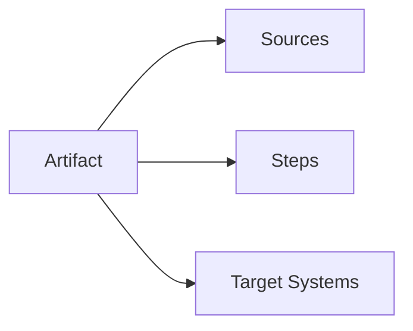

An artifact is the core unit of work in Vorpal. It represents something you want to build -- a binary, a library, a development environment, or any other output. Artifacts are content-addressed, meaning they are identified by a SHA-256 hash of their inputs. This page explains how artifacts work and why they are designed this way.

## Anatomy of an artifact

Every artifact has four components:

- **Name** -- A human-readable identifier (e.g., `my-app`, `dev-shell`)
- **Sources** -- Input files that the build steps operate on. Sources can come from the local filesystem or HTTP URLs.
- **Steps** -- The build instructions. Each step has an entrypoint (the program that runs the step), arguments, environment variables, and optional secrets.
- **Target systems** -- The platforms this artifact can be built for (e.g., `AARCH64_DARWIN` for macOS Apple Silicon, `X8664_LINUX` for Linux x86_64)



## Content addressing

Vorpal serializes the entire artifact definition (name, sources, steps, target systems) to JSON and computes a SHA-256 hash. This hash -- the **content digest** -- becomes the artifact's identity.

This design has two important properties:

1. **Deterministic caching** -- Two artifacts with identical inputs always produce the same digest. If you have not changed anything, the cached output is guaranteed to be correct. There is no cache invalidation logic to get wrong.

2. **Safe sharing** -- Because the digest encodes all inputs, you can safely share cached artifacts across machines and teams. If two developers build the same artifact with the same inputs, they get the same digest and can reuse each other's cached output.

When you change any input -- a source file, an environment variable, a build step argument -- the digest changes, and Vorpal treats it as a new artifact that needs to be built from scratch. This is intentional: it eliminates an entire class of "stale cache" bugs.

## Sources

Sources define the input files for your build. Each source has:

- A **path** -- local filesystem path or HTTP URL
- **Includes/excludes** -- file patterns to filter which files are included
- A **digest** -- SHA-256 hash of the source content, computed automatically

For local sources, Vorpal reads files from disk and computes their content hash. For HTTP sources, Vorpal downloads the archive, auto-detects its format (gzip, bzip2, xz, zip), unpacks it, and computes the hash of the contents.

### Lockfile

Source digests are recorded in `Vorpal.lock`. Once a source is locked, Vorpal rejects changes to that source unless you explicitly pass `--unlock`. This prevents builds from silently changing because an upstream URL started serving different content.

```toml
lockfile = 1

[[sources]]
name = "toolchain"
digest = "a1b2c3..."
platform = "aarch64-darwin"
path = "https://example.com/toolchain.tar.gz"
```

The lockfile pins digests per-platform because the same source URL may serve different binaries for different architectures.

## Build steps

Each artifact has one or more build steps that are executed sequentially. A step consists of:

- **Entrypoint** -- The program that executes the step. Defaults to `bash`, but can be `docker`, `bwrap` (Bubblewrap), or any executable.
- **Script or arguments** -- Either an inline script (for shell entrypoints) or command-line arguments (for other entrypoints).
- **Dependency artifacts** -- References to other artifacts whose outputs this step needs. Dependencies are available as directories at paths provided through environment variables.
- **Environment variables** -- Key-value pairs injected into the step's environment.
- **Secrets** -- Sensitive values that are encrypted by the Agent and decrypted by the Worker at execution time. Never stored in plaintext in the artifact definition.

During execution, each step receives these environment variables:

| Variable | Description |
|----------|-------------|
| `VORPAL_OUTPUT` | Path where the step should write its output |
| `VORPAL_WORKSPACE` | Path to the working directory containing sources |
| `VORPAL_ARTIFACT_<digest>` | Path to each dependency artifact's output |

## Artifact types

The SDKs provide high-level builders for common artifact patterns:

### Language artifacts

`Rust`, `Go`, and `TypeScript` builders handle the full compilation pipeline for their respective languages. You specify source files, and the builder generates the appropriate build steps, toolchain dependencies, and platform targeting.

### Development environments

`DevelopmentEnvironment` creates portable development shells with pinned tools and environment variables. When activated, a development environment provides a consistent set of tools regardless of what is installed on the host system.

### User environments

`UserEnvironment` installs tools and configurations into the user's home directory (`~/.vorpal/`). Unlike development environments (which are project-scoped), user environments persist across projects.

### Custom artifacts

The base `Artifact` type lets you define arbitrary build steps with any entrypoint. This is how you use Docker, Bubblewrap, or custom executors. See the [Quickstart](../getting-started/quickstart) for a basic example, or the SDK guides ([Rust](../guides/rust), [Go](../guides/go), [TypeScript](../guides/typescript)) for detailed usage.

## Cross-platform targeting

Every artifact declares which platforms it supports using the `ArtifactSystem` enum:

| Value | Platform |
|-------|----------|
| `AARCH64_DARWIN` | macOS Apple Silicon |
| `AARCH64_LINUX` | Linux ARM64 |
| `X8664_DARWIN` | macOS Intel |
| `X8664_LINUX` | Linux x86_64 |

When you build an artifact, Vorpal only builds it for the current host platform. The target systems declaration is used by the SDK builders to generate platform-appropriate build steps (e.g., selecting the right toolchain download URL for the host architecture).

## Aliases

Artifacts can have named aliases like `latest` or a version string. Aliases let you run artifacts by name (`vorpal run my-app`) instead of by their full content digest. The Registry stores the mapping from alias to digest.

## Built-in artifacts

The Vorpal SDK ships with pre-built artifact definitions for common tools and runtimes. These can be used as dependencies in your own artifacts via `with_artifacts` / `WithArtifacts`.

Not all built-in artifacts are available in every SDK. The tables below indicate availability with checkmarks.

### Tools

| Artifact | Description | Rust | Go | TypeScript |
|----------|-------------|:----:|:--:|:----------:|
| `Bun` | JavaScript/TypeScript runtime and package manager | ✅ | ✅ | ✅ |
| `Cargo` | Rust package manager | ✅ | ✅ | ✅ |
| `Clippy` | Rust linter | ✅ | ✅ | ✅ |
| `Crane` | Container image tool | ✅ | ✅ | ✅ |
| `Gh` | GitHub CLI | ✅ | ✅ | ✅ |
| `Git` | Version control | ✅ | ✅ | ✅ |
| `Go` / `GoBin` | Go compiler and tools | ✅ | ✅ | ✅ |
| `Goimports` | Go import formatter | ✅ | ✅ | ✅ |
| `Gopls` | Go language server | ✅ | ✅ | ✅ |
| `Grpcurl` | gRPC command-line client | ✅ | ✅ | ✅ |
| `NodeJS` | Node.js runtime | ✅ | ✅ | ✅ |
| `Pnpm` | Node.js package manager | ✅ | ✅ | ✅ |
| `Protoc` | Protocol Buffers compiler | ✅ | ✅ | ✅ |
| `ProtocGenGo` | Protobuf Go code generator | ✅ | ✅ | ✅ |
| `ProtocGenGoGrpc` | Protobuf Go gRPC code generator | ✅ | ✅ | ✅ |
| `Rsync` | File synchronization tool | ✅ | ✅ | ✅ |
| `RustAnalyzer` | Rust language server | ✅ | ✅ | ✅ |
| `Rustc` | Rust compiler | ✅ | ✅ | ✅ |
| `Rustfmt` | Rust formatter | ✅ | ✅ | ✅ |
| `Staticcheck` | Go static analysis tool | ✅ | ✅ | ✅ |

> **Note:** The Go SDK names the Go compiler artifact `GoBin` instead of `Go`. The TypeScript SDK exports it as `GoBin` from `artifact/go.ts`.

### Rust toolchain

| Artifact | Description | Rust | Go | TypeScript |
|----------|-------------|:----:|:--:|:----------:|
| `RustSrc` | Rust source code (for rust-analyzer) | ✅ | ✅ | ✅ |
| `RustStd` | Rust standard library | ✅ | ✅ | ✅ |
| `RustToolchain` | Complete Rust toolchain bundle | ✅ | ✅ | ✅ |

### Linux images

| Artifact | Description | Rust | Go | TypeScript |
|----------|-------------|:----:|:--:|:----------:|
| `LinuxDebian` | Debian-based Linux base image | ✅ | ❌ | ❌ |
| `LinuxVorpal` | Vorpal Linux base image | ✅ | ❌ | ❌ |
| `LinuxVorpalSlim` | Minimal Vorpal Linux image | ✅ | ✅ | ❌ |

### Container images

| Artifact | Description | Rust | Go | TypeScript |
|----------|-------------|:----:|:--:|:----------:|
| `OciImage` | OCI container image builder | ✅ | ✅ | ✅ |
