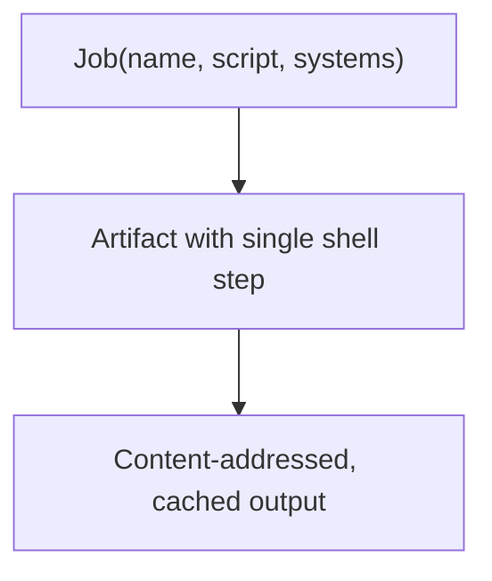

A **Job** is a script-based build unit that wraps a shell command into a content-addressed artifact. Jobs are the simplest way to run a one-off task -- a version check, a test suite, a data migration, or any command that runs to completion and exits.

## How jobs work

A Job takes a name, a shell script, and a list of target systems. Under the hood, it creates an [artifact](/concepts/artifacts/) with a single shell step that executes your script. The output is content-addressed and cached like any other Vorpal artifact.



## When to use a Job

Use a Job when you need to:

- Run a command that produces output and exits (not a long-running service)
- Wrap existing CLI tools into reproducible, cached build steps
- Compose multiple artifacts together into a single execution

If your task needs to run continuously (a server, a watcher, a daemon), use a [Process](/concepts/processes/) instead.

## Defining a Job

### Rust

```rust
use vorpal_sdk::{
    artifact::{get_env_key, Job},
    context::get_context,
    api::artifact::ArtifactSystem::{Aarch64Darwin, Aarch64Linux, X8664Darwin, X8664Linux},
};

#[tokio::main]
async fn main() -> anyhow::Result<()> {
    let ctx = &mut get_context().await?;
    let systems = vec![Aarch64Darwin, Aarch64Linux, X8664Darwin, X8664Linux];

    let tool = build_my_tool(ctx).await?;
    let script = format!("{}/bin/my-tool --version", get_env_key(&tool));

    Job::new("my-job", script, systems)
        .with_artifacts(vec![tool])
        .build(ctx)
        .await?;

    ctx.run().await
}
```

### Go

```go
script := fmt.Sprintf("%s/bin/my-tool --version", artifact.GetEnvKey(*tool))

artifact.NewJob("my-job", script, systems).
    WithArtifacts([]*string{tool}).
    Build(ctx)
```

### TypeScript

```typescript
import {
  ConfigContext,
  ArtifactSystem,
  Job,
  getEnvKey,
} from "@altf4llc/vorpal-sdk";

const SYSTEMS = [
  ArtifactSystem.AARCH64_DARWIN,
  ArtifactSystem.AARCH64_LINUX,
  ArtifactSystem.X8664_DARWIN,
  ArtifactSystem.X8664_LINUX,
];

const context = ConfigContext.create();

const tool = await buildMyTool(context);
const script = `${getEnvKey(tool)}/bin/my-tool --version`;

await new Job("my-job", script, SYSTEMS)
  .withArtifacts([tool])
  .build(context);

await context.run();
```

## Builder options

| Method | Description |
|--------|-------------|
| `new(name, script, systems)` | Create a Job with a name, shell script, and target platforms |
| `with_artifacts(artifacts)` | Add dependency artifacts whose outputs are available during execution |
| `with_secrets(secrets)` | Add encrypted secrets available as environment variables at runtime |

## How it differs from an Artifact

A Job is a thin convenience wrapper around an [Artifact](/concepts/artifacts/). Under the hood, `Job.build()` creates an Artifact with a single shell step and calls `Artifact.build()`, so Jobs go through the same content-addressed pipeline -- identical inputs produce a cache hit and the build is skipped.

The difference is ergonomic, not behavioral:

- An **Artifact** gives you full control over multiple steps, sources, and build logic.
- A **Job** provides a streamlined API for the common case of running a single shell script with optional artifact dependencies and secrets.

### CI and automation as code

The bigger picture behind Jobs is that they let you define your entire CI and automation pipeline as code -- in the same language as your build config -- and run it anywhere. Locally, in GitHub Actions, on a remote server, or on any machine with Vorpal installed.

Instead of maintaining platform-specific YAML for each CI provider, you write your pipeline once as Jobs and execute them everywhere. This is similar in spirit to projects like [Dagger](https://dagger.io), where your pipeline is a real program, not a config file.
