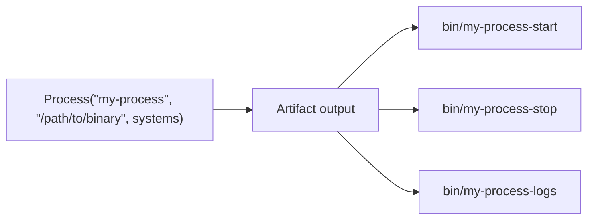

A **Process** is a long-running artifact that wraps a binary into a managed service with start, stop, and log scripts. Use a Process when you need to run something that stays alive -- a server, a background worker, or any daemon that should run continuously.

## How processes work

A Process takes a name, an entrypoint binary, and target systems. Vorpal generates three lifecycle scripts in the artifact output:

| Script | Purpose |
|--------|---------|
| `bin/{name}-start` | Start the process in the background, writing its PID to a file and output to a log |
| `bin/{name}-stop` | Stop the process by sending SIGTERM to the recorded PID |
| `bin/{name}-logs` | Tail the process log file |



The process runs in the background. The start script writes the PID to `$VORPAL_OUTPUT/pid` and streams stdout/stderr to `$VORPAL_OUTPUT/logs.txt`.

## When to use a Process

Use a Process when you need to:

- Run a long-lived service (API server, build registry, worker)
- Manage service lifecycle with start/stop/logs scripts
- Compose a service with its dependencies into a single deployable artifact

If your task runs to completion and exits, use a [Job](/concepts/jobs/) instead.

## Defining a Process

### Rust

```rust
use vorpal_sdk::{
    artifact::{get_env_key, Process},
    context::get_context,
    api::artifact::ArtifactSystem::{Aarch64Darwin, Aarch64Linux, X8664Darwin, X8664Linux},
};

#[tokio::main]
async fn main() -> anyhow::Result<()> {
    let ctx = &mut get_context().await?;
    let systems = vec![Aarch64Darwin, Aarch64Linux, X8664Darwin, X8664Linux];

    let server = build_my_server(ctx).await?;

    Process::new(
        "my-server",
        &format!("{}/bin/my-server", get_env_key(&server)),
        systems,
    )
    .with_arguments(vec!["--port", "8080"])
    .with_artifacts(vec![server])
    .build(ctx)
    .await?;

    ctx.run().await
}
```

### Go

```go
process, _ := artifact.NewProcess(
    "my-server",
    fmt.Sprintf("%s/bin/my-server", artifact.GetEnvKey(*server)),
    systems,
).
    WithArguments([]string{"--port", "8080"}).
    WithArtifacts([]*string{server}).
    Build(ctx)
```

### TypeScript

```typescript
import {
  ConfigContext,
  ArtifactSystem,
  Process,
  getEnvKey,
} from "@altf4llc/vorpal-sdk";

const SYSTEMS = [
  ArtifactSystem.AARCH64_DARWIN,
  ArtifactSystem.AARCH64_LINUX,
  ArtifactSystem.X8664_DARWIN,
  ArtifactSystem.X8664_LINUX,
];

const context = ConfigContext.create();

const server = await buildMyServer(context);

await new Process(
  "my-server",
  `${getEnvKey(server)}/bin/my-server`,
  SYSTEMS,
)
  .withArguments(["--port", "8080"])
  .withArtifacts([server])
  .build(context);

await context.run();
```

## Builder options

| Method | Description |
|--------|-------------|
| `new(name, entrypoint, systems)` | Create a Process with a name, binary path, and target platforms |
| `with_arguments(args)` | Add command-line arguments passed to the entrypoint |
| `with_artifacts(artifacts)` | Add dependency artifacts whose outputs are available at runtime |
| `with_secrets(secrets)` | Add encrypted secrets available as environment variables |

## Lifecycle management

Once built, manage the process using the generated scripts:

```bash
# Start the process
$(vorpal build --path my-server)/bin/my-server-start

# View logs
$(vorpal build --path my-server)/bin/my-server-logs

# Stop the process
$(vorpal build --path my-server)/bin/my-server-stop
```

## How it differs from an Artifact

A Process is built on top of an [Artifact](/concepts/artifacts/) -- internally, `Process.build()` calls `Artifact.build()`, so Processes go through the same content-addressed caching pipeline as any other artifact. If the inputs (entrypoint, arguments, dependencies, secrets) have not changed, Vorpal returns a cache hit and skips the build step entirely. What makes a Process different is what it produces: the artifact output contains generated lifecycle scripts (start, stop, logs) for managing a long-running service rather than a one-shot result.

Unlike [Jobs](/concepts/jobs/), which run a script to completion and exit, Processes are designed for anything that needs to stay alive:

- API servers and backend services
- Build registries and artifact stores
- Background workers and daemons
- Development servers for local workflows

### Infrastructure as code

Just as Jobs let you define CI pipelines as code, Processes let you define your service infrastructure as code. Instead of writing Dockerfiles, systemd units, or platform-specific service definitions, you describe your services as Processes in the same language as your build config and run them anywhere Vorpal is installed.
